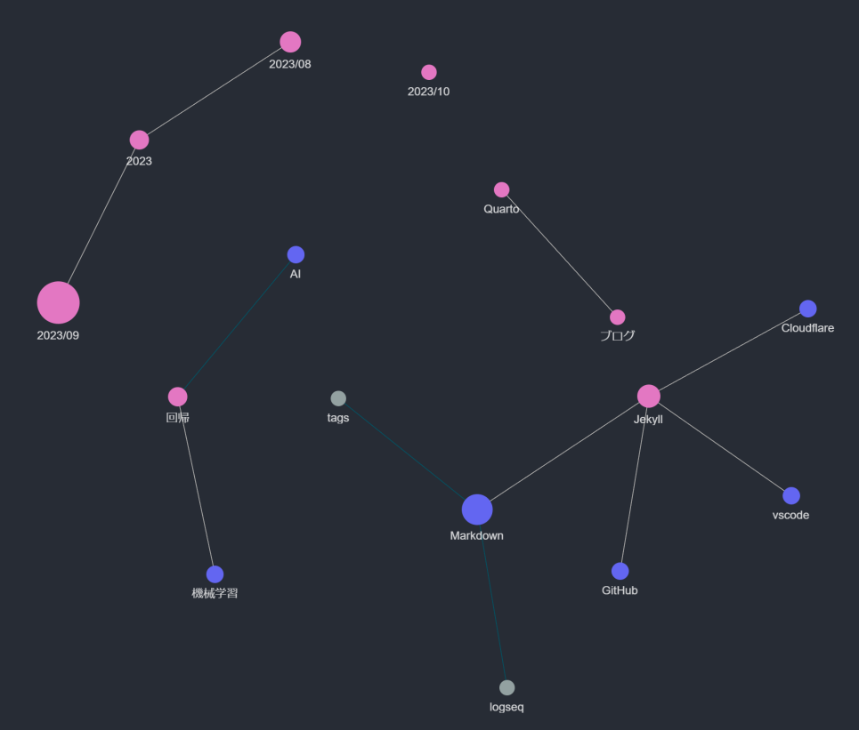

---

## デジタルガーデン

### デジタルガーデンとは

デジタルガーデンを一言でいうとデジタル上で自分の好きなことをする場所です。

### SNSとの違い

SNSに比べてデジタルガーデンは…

- **一人で黙々とやる**イメージ
  - 評価を気にしない(再生数、イイネなど)
  - 自分がわかればよいのでデザインが*独創的*、人によっては見づらい
  - 公開しなくてもよい

デジタルガーデンの定義としては、その媒体を制限しないと思いますが、今回は文書で*メモ*のようなものを残すことでデジタルガーデンを作っていく話をします。

---

## メモの取り方 (Zettelkastenについて)

私のデジタルガーデンでは、Zettelkastenに倣ったメモを残します。

Zettelkastenについて、Bing Chatの説明

> Zettelkastenは、ドイツ語で「引き出し箱」という意味のノート術です。このノート術は、知識を繋げて整理することにフォーカスしており、一つのアイデアを一つのメモに短く記し、それを順番ごとに分けた箱で管理するというのが大きな特徴です。知識を繋げることによって、単一的な知識に留まらず、独創的なアイデアを作り出すことができます。Zettelkastenは、20世紀ドイツの社会学者ニクラス・ルーマンが研究と論文執筆のために考案したと言われており、多くの面で成功を収めました。Zettelkastenを運用する上で得られるメリットは、知識を繋げて整理できることが従来のノート術に比べて明らかにメリットと言える点です。Zettelkastenは、Roam Research, Obsidian, Scrapbox, Logseqなどのアプリで運用することができます。

重要なことは*短いメモ*を*整理して*、*つなげる*ことです。

こうして整理されたメモは*セカンドブレイン*とも呼ばれます。

---
layout: two-cols-header
---

## メモを取る意味

::left::

- *脳内の整理*
- 備忘録(2週間後の自分は他人)
- 世の中の役に立つ(かもしれない)
- **新たな知識の創発**
- LLMの学習、ベクトルデータベースの構築

::right::

---
layout: two-cols-header
---

## Logseqでデジタルガーデンを構築

::left::

Logseqは一言でいうと**リンク付きのメモ**ができるソフトウェアです。

- 🌱 (種まき)日々のメモを記述
- 💧 (水やり)メモを詳細化
- ✂️ (剪定)メモの整理
- 🌾 (収穫)ブログ化、プレゼン化

(右図はハチアンのLogseqグラフ)

::right::

---

## Logseqの代替

ノートをとれる類似のソフトはたくさんあります。

それぞれ少しずつ特徴が違いますが、できることはだいたい一緒です。

- [Roam Research](https://roamresearch.com/)
- [Obsidian](https://github.com/obsidianmd/obsidian-releases)
- [Joplin](https://github.com/laurent22/joplin)
- [AFFiNE](https://github.com/toeverything/AFFiNE)
- [SiYuan](https://github.com/siyuan-note/siyuan)
- [Trilium](https://github.com/zadam/trilium)
- [Dendron](https://github.com/dendronhq/dendron)
- Notion(+プラグイン)

---

## メモツールの選び方

以下の部分はツール依存のことが多い気がします。

- エディタの使い心地
- 記法の違和感のなさ
- カスタマイズ可能性
- デバイス間の同期
- Web上に公開可能か、その方法
- ライセンス

エディタの使い心地は実際に使わないとわかりません。無料で試せるものが多いので、いろいろ使ってみるのがいいかもしれません。

---

## Logseqを使ってみる

ハンズオン的にLogseqを使ってみます。

以下を説明します。

- 日記(Journal)ページ
- Markdown記法
- `[[リンク]]`のようにリンクを表現(Wikilink)
- `#タグ`のようにタグを表現
- Linked ReferenceとUnlinked Reference
- `/TODO`でやることリストを作成
  - `/Scheduled`で期限を記載
  - `{{query #TODO}}`でTODOを検索
